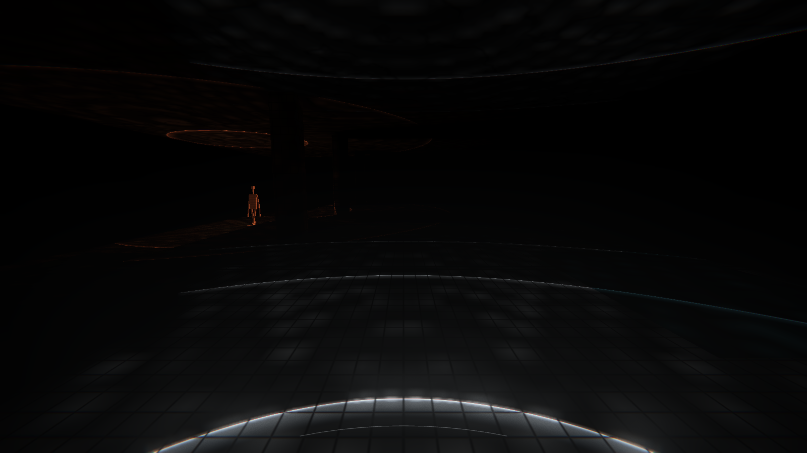
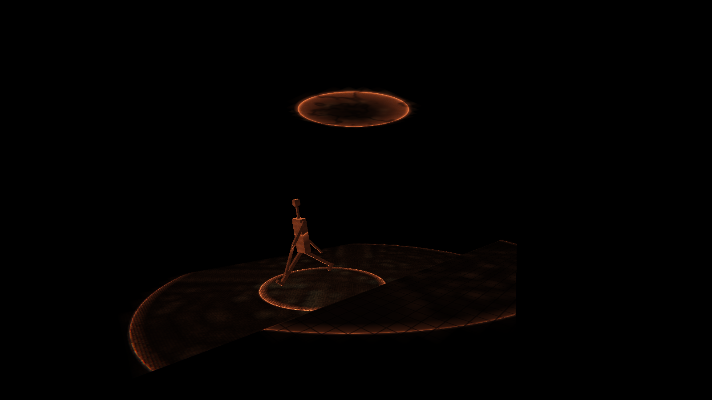
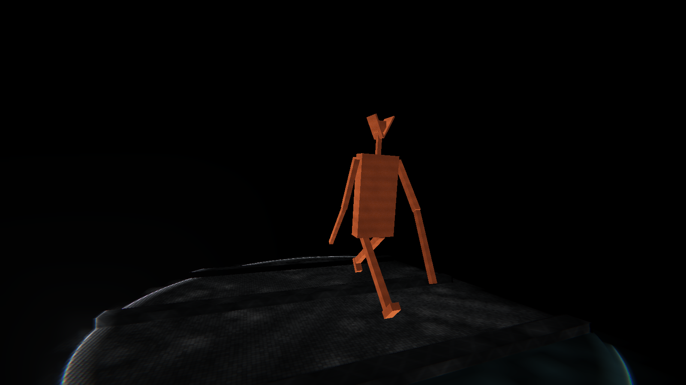
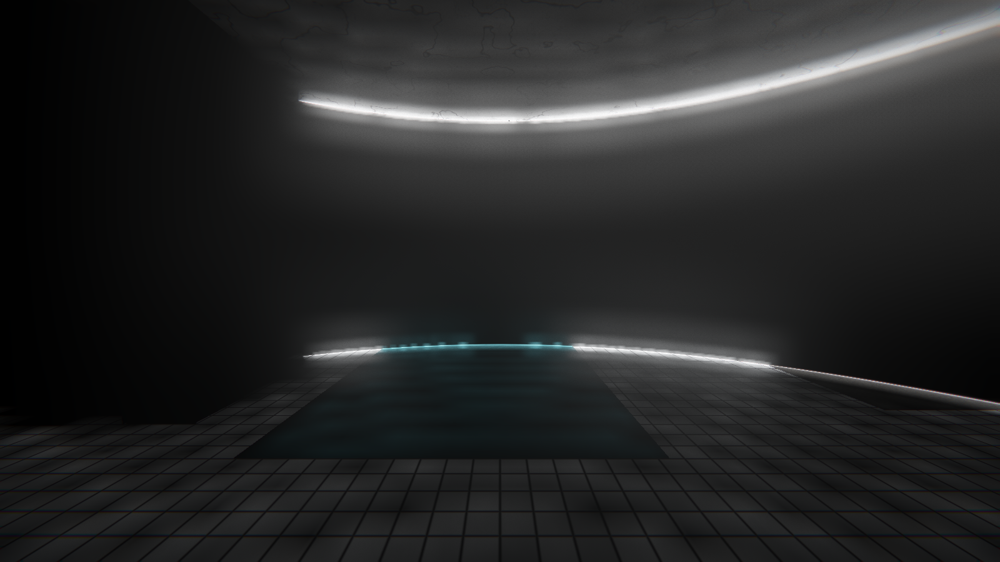
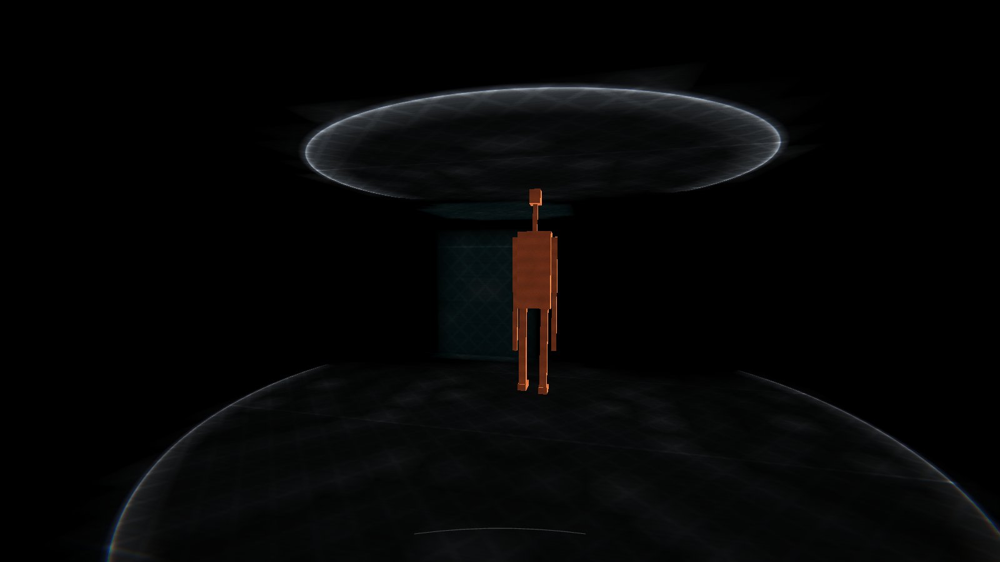
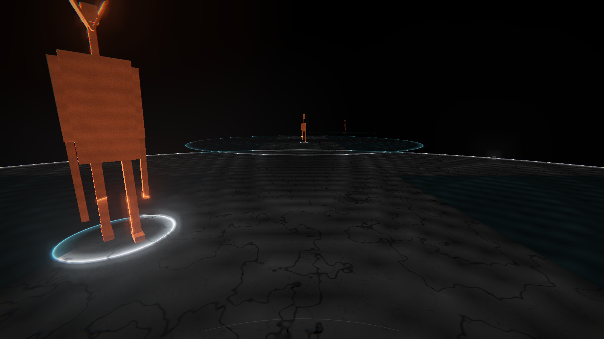
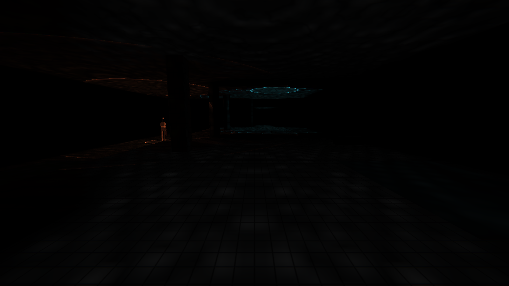

# REVERB

**A first-person stealth game played in absolute darkness, where sound is the only light.**

There is no ambient light in the station. No torch. No flashlight battery to find.
You see nothing — until something makes a noise.

Every sound in the world emits an expanding spherical wavefront that illuminates
the geometry it touches, and then dies. Your footsteps draw the floor around you.
A drip from the ceiling reveals a small arch of tunnel. A gunshot detonates the
entire room in white for a quarter of a second — and pulls everything alive in it
toward you.

The things down there are blind too. They hunt by sound alone. Silence is your
only cover, and your eyesight is exactly the thing that gives you away.



| | |
|---|---|
|  |  |
| A Stalker mid-stride. You can see it only because it is making noise. | A Sentinel. It has not moved yet. |
|  |  |
| One shot, and the room is white for a quarter of a second. | MAINTENANCE: the plant fires, and for a moment you can see the door. |
|  |  |
| THE DEEP. Nothing here stops sound. | Ten seconds later: only the imprint, going. |

More in `docs/screenshots/`, all generated by `node scripts/capture.mjs`.

```
npm install
npm run dev      # http://127.0.0.1:5173
npm run build    # -> dist/
npm run preview
```

Requires WebGL2. Click to lock the mouse. Audio starts on your first input —
without it the game is, quite literally, unplayable.

---

## Controls

| | |
|---|---|
| `W A S D` | move — normal walking is loud |
| `Shift` | sneak: slow, and almost no light |
| `Ctrl` / `C` | crouch |
| `Space` | run: fast, brilliant, suicidal |
| `Q` / right mouse | throw a stone — makes a pulse somewhere you are not |
| Left mouse | fire |
| `P` | photo mode: hides the interface, grabs a high-resolution still |
| `M` | mute |
| `R` | restart the level |

No crosshair. It is not an oversight.

---

## The five descents

1. **PLATFORM** — one creature on the tracks, and drips that show you north.
2. **TURNSTILES** — a hall of gates standing in water. There is no dry way through, only a quieter one.
3. **THE TUNNEL** — ballast underfoot, the loudest ground in the station, and three Sentinels who do not move.
4. **MAINTENANCE** — the plant runs on a clock. Move inside its noise.
5. **THE DEEP** — an open cavern. Nothing here stops sound. Everything hears everything.

Each level ends on a black card: your time, how many shots you fired, and how
much total noise you made. Clear a level without firing and stay under the noise
threshold and it reads `UNHEARD`.

---

## How it works

### The pulse field is the renderer

`src/render/pulses.js` holds a pool of up to 32 live wavefronts. Each is a
position, a current radius, an expansion speed, an intensity, a colour, a shell
thickness, and a flag for whether it reveals living things. The pool is packed
into flat `Float32Array`s and uploaded as uniform arrays — it never allocates
during play.

`src/render/shaders/lighting.glsl.js` is the whole lighting model. For every
pixel, for every live pulse, it measures the distance to the source and lights
only the thin shell where `|dist − radius| < thickness`. There is no ambient
term, no fill, no fake bounce. If that loop returns zero, the pixel is `#000000`.

Three details make the shell read as a *line* rather than a glowing ball:

- **It is asymmetric.** The leading edge is `0.30 × thickness`; the wake behind
  it is `1.70 × thickness`. A razor front with a soft tail reads as motion.
- **It has a filament.** The shell brightness is `s² × 0.32 + s²⁶ × 3.2`. The
  `s²` term is a dim body; the `s²⁶` term only exists within a few centimetres
  of the crest, and it is the hairline that makes the thing read as a *line*.
  Getting this exponent wrong is the difference between a moving edge and a
  glowing bubble — the first pass used `s¹⁴` and looked like fog.
- **It obeys `1/r²` and time.** Intensity is `power × (1 − t/life)²`, attenuated
  by `1 / (1 + (d/ref)²)`. Each sound carries its own reference distance: a
  footstep uses 1.8 m and dies at two, a gunshot uses 7.5 m and fills the room.
  One knob, and inverse-square is still inverse-square.

### Sound does not go through walls

Each level bakes a top-down occupancy grid of its wall segments
(`src/world/builder.js`), blurred so a coarse march cannot step over a thin
partition, and uploaded as a texture. Every lit pixel ray-marches eighteen
samples in XZ from itself back to the pulse origin and attenuates by what it
crosses. The same grid is sampled on the CPU by `SoundWorld.transmission()`, so
enemies hear through exactly the walls the light stops at.

Only partitions taller than 1.7 m are stamped into it. Sound goes over a bench,
a turnstile stall and a railway sleeper; stamping those made THE TUNNEL
acoustically opaque along its entire length, which is a very quiet bug to find.

### Light memory

A wavefront passes in a quarter of a second. If that were all, the game would be
unreadable — you would never hold a mental picture of a room.

So `src/render/memory.js` runs a second pass every frame that rasterises the
level geometry into its **lightmap chart** instead of into the camera, and
accumulates `max(previous × decay, current)` into a ping-ponged half-float
atlas. Revealed geometry stays faintly visible for about two and a half seconds
and then is gone.

What gets stored is `lit / (1 + lit)`, not `lit`. Memory records *that* you saw
a surface, not how hard it was hit — store raw radiance and a single gunshot
paints the whole room white for three seconds, and the imprint stops being a
hint and becomes a floodlight.

This is a lightmap, not a screen-space trail. The imprint is anchored to the
world, so turning your head does not smear it and walking backwards does not
erase it. Every quad in the level gets its own chart from a shelf packer, and
walls are emitted as two back-to-back faces so the memory of one room cannot
bleed through to the next.

### The contract between audio and light

`src/audio/sound.js` is the only file allowed to play a sound, and the only file
allowed to create a pulse. It always does both, in one call, along with telling
the AI what it just heard:

> a sound that is heard must light the world
> a light in the world must have been heard

There is no code path that produces one without the other. Player, enemies,
drips, machinery and the passing train all go through `sound.emit()`.

### All audio is synthesised

No audio files. Filtered noise bursts, oscillators with pitch envelopes, ADSR
gain stages, a `WaveShaper` for the Screamer's distortion. Everything runs
through an `HRTF` `PannerNode` — locating an enemy by ear is the primary sense in
this game, not a flourish.

The reverb is a `ConvolverNode` fed a procedurally generated impulse response:
exponentially decaying coloured noise whose spectrum darkens over the tail, plus
seven discrete early reflections. Each level declares its own decay time,
brightness, pre-delay and reflection spread, so THE TUNNEL rings for four and a
half seconds and MAINTENANCE barely rings at all.

### The blind

Four states: `IDLE` (patrolling, breathing occasionally), `ALERT` (heard
something, stopped, turning toward it), `SEARCH` (walking to the source),
`HUNT` (locked on and running). Loudness reaching an enemy is
`loudness / (1 + d² × 0.03) × transmission`, accumulated into a confidence value
that decays.

They are **not lit by your footsteps**. `uPulseData[i].w` gates whether a pulse
touches a living body, and only gunfire, screams and the train set it. The rest
of the time a creature is visible only through its own `uGlow`, which is driven
by the noise it is making right now. A standing enemy is completely invisible.

- **Stalker** — patrols, chases, ordinary and therefore the one you will meet most.
- **Screamer** — when it locks on it screams, which lights half the level orange
  and calls every other creature to your position.
- **Sentinel** — never patrols. Stands in the dark with two flat plates canted off
  its skull and does not move until it is certain. The only enemy you can walk
  straight into.

All three are built from boxes with deliberately wrong proportions — too tall,
arms past the knee, a neck that goes on for a foot and a half. They are shaded
silhouette-first: a strong Fresnel rim carries the shape and the interior stays
void, which is why an orange figure reads instantly against a cold-white room.

### Surfaces

Six, each with an acoustic profile and a procedural shader (`src/render/shaders/surfaces.glsl.js`):

| surface | noise | what it does |
|---|---|---|
| carpet | ×0.22 | drinks light and sound. The safe road. |
| concrete | ×1.00 | the baseline |
| tile | ×1.25 | grouted, slightly glossy |
| steel | ×1.70 | brushed streaks, bright specular |
| water | ×2.15 | animated ripple normals, glinting highlights, very loud |
| ballast | ×2.60 | per-pebble randomised normals, the worst ground in the station |

Puddles sparkle when a wavefront crosses them because the ripple gradient
perturbs the shading normal and the specular lobe is narrow. That glitter is the
single most legible "this ground will kill you" signal in the game.

### Interface

There isn't one. No health bar, no ammo counter, no crosshair, no numbers, no
rectangles in the corners.

- **Noise meter** — a single hairline arc struck from a centre far below the
  frame, so only its crown is on screen. Its sweep is how far your last sound
  travelled. It fades in about a second and a half.
- **Being hurt** — your heartbeat becomes a light source. It emits a real pulse
  through the same `sound.emit()` path as everything else, which means it shows
  you the room *and* shows the room you. The wound is the punishment; there is no
  red screen telling you about it.
- **Out of ammo** — you hear a dry click. That is the whole ammo UI.
- Text is a system monospace stack at wide letter-spacing, upper case, white on
  black. No web fonts are fetched. There is no fallback to Arial anywhere.

### Post

`EffectComposer`: render → `UnrealBloomPass` (strength 0.55, radius 0.34,
threshold 0.55) → one custom final pass doing chromatic aberration weighted by
`r⁴` so it only touches the far corners, an exponential exposure curve that
reaches true white without ever lifting true black, film grain **gated on
luminance so unlit pixels stay exactly `#000000`**, and a vignette.

The grain gate matters more than it sounds. Ungated grain across a 95%-black
frame turns the whole premise into grey mush.

---

## Design decisions I made along the way

**Sound travels at 7–34 m/s, not 343.** Real physics puts the wavefront across a
room inside one frame. The whole game is watching the shell travel, so the speed
of sound is an art direction parameter. Gunfire is fastest (30 m/s) because it
should feel like a detonation; a drip is slowest (8 m/s) because you want to
watch it crawl.

**The imprint is a lightmap, not an afterimage.** I tried screen-space
accumulation first. It smears the instant you turn your head, and the smear is
attached to your view rather than to the room, which reads as a rendering bug
rather than as memory. Texture-space accumulation costs a second geometry pass
per frame and is worth every millisecond.

**Enemies are not lit by your footsteps.** Physically they should be. But
"a standing enemy is completely invisible" is a better rule than a consistent
one, because it means the tension in a room is entirely about whether something
in it is currently moving. The exception is gunfire, which reveals everything —
that is the trade the weapon actually offers.

**Walls are two faces, not one.** A single double-sided quad shares one lightmap
texel between both rooms it separates, so the memory of one room glows faintly
through into the next. Doubling the geometry costs atlas space and removes the
artifact completely.

**Occlusion is a blurred 2D grid, not a raycast.** Per-pixel raycasting against
real geometry for 32 sources is not affordable. A 0.4 m occupancy grid, stamped
thick and blurred twice, gives sound a soft shadow at wall edges — which happens
to be what diffraction looks like anyway. The CPU and GPU sample the same field,
so what you see and what the AI hears never disagree.

**The heartbeat goes through `sound.emit()`.** It would have been easy to special-case
the wounded-player glow as a plain light. Routing it through the same contract as
everything else means the enemies hear your pulse, which turns injury into a
mechanic instead of a status effect.

**The palette is de-gamma'd on the way in.** The shader works in linear light
and the final pass encodes to sRGB, so feeding it `#C4522A` directly and then
gamma-encoding the result produces beige. Each palette entry is raised to 2.2
and normalised to a peak of 1, which both restores the rust and makes `power`
mean the same thing whatever the hue: brightness lives in the pulse, colour
lives in the palette.

**The hum is not silent light.** A continuous electrical drone that never
illuminates anything would break the first pillar outright. So the bed is paired
with a failing fluorescent ballast: every few seconds it ticks over, the hum
swells, and a thin cyan ring falls out of the ceiling. The drone is the sound of
that ring still ringing.

**No music.** Ambience only: the drips, the plant, the settling of the building,
and occasionally a train passing somewhere above that shakes the whole station
and lights it end to end for a second. Silence is the soundtrack, and it only
works if nothing is competing with it.

---

## Audio, measured

I cannot hear this game. So it is measured instead of guessed at.

`node scripts/audio-check.mjs` renders every voice offline through an
`OfflineAudioContext` carrying the **exact** graph the game plays through — same
limiter, same convolver, same panner, same trim table — and checks the numbers
against thresholds. It exits non-zero on failure. `src/audio/probe.js` is the
in-page half; nothing in it runs during play.

What it measures, and what it caught on the first run:

| check | first run | now |
|---|---|---|
| loudest voice | **scream**, not the gunshot | gunshot at −4.5 dBFS, scream −7.7 |
| ambient bed under the gunshot | 13.7 dB | 37.7 dB |
| walking step vs. the bed | **6.8 dB below it** | 20.7 dB above it |
| RT60, THE TUNNEL | 1.1 s (declared 4.6) | 2.53 s (declared 2.7) |
| RT60, MAINTENANCE | 0.42 s | 0.61 s |
| C50 clarity, PLATFORM | −4.0 dB, tail burying the source | +2.9 dB |
| stereo separation at 90° | 4.3 dB | 11.1 dB |
| samples over 1.0 | none | none |

The four fixes behind that table:

- **The compressor was doing the mixing.** At −8 dB with a ratio of 9 it sat on
  every transient and flattened a gunshot down to the level of a sustained
  scream, so the loudness hierarchy was being decided by the limiter rather than
  by gain staging. It is now a safety net at −1 dB, ratio 20, and nothing
  normally reaches it. The mix lives in one measured `TRIM` table in
  `src/audio/voices.js`.
- **RT60 was a fiction.** `space.decay` was the buffer length, not the decay
  time; the envelope `(1−t)^2.1 · e^(−3.2t)` meant a level declaring 4.6 s
  actually rang for about 1.1. Levels now declare `rt60` and the envelope is
  `e^(−6.9078 t / rt60)`, which is −60 dB at exactly `t = rt60`. The rig
  verifies every level to within 7%.
- **The impulse response was peak-normalised**, so the wet return got louder the
  longer the tail was — which is precisely how a tunnel ends up swallowing its
  own source. It is now energy-normalised with a mild `rt60` compensation.
- **HRTF alone gave 4.3 dB of channel separation** for a source hard on one
  side. That is physically honest — interaural level difference really is small
  below a couple of kHz — but this game asks you to find a creature in the dark
  by ear, so the cue has to be unmissable. HRTF is kept for its spectral and
  timing cues, which are what distinguish in front from behind, and a
  `StereoPannerNode` driven by the source azimuth widens the result to 11 dB.

Clarity is checked as **C50** — energy in the first 50 ms against everything
after it — not as a whole-window wet/dry RMS ratio. The obvious test is the
wrong one: a long tail fills more of a fixed window and scores "wetter" even
when the direct sound is perfectly clear.

Full output of the current run:

```
== impulse responses ==================================
space          declared measured      len   verdict
PLATFORM            1.9    1.792    2.185    ok 
TURNSTILES          1.3    1.227    1.495    ok 
THE TUNNEL          2.7    2.573    3.105    ok 
MAINTENANCE        0.65    0.603    0.748    ok 
THE DEEP            3.2    3.023     3.68    ok 
   ok   tunnel in 1.5–3.0s
   ok   maintenance under 0.8s

== voice levels (dBFS, through limiter) ===============
voice              peak      rms   clip
shot              -5.07   -27.22    -
scream            -8.01      -26    -
train             -8.39   -28.58    -
hurt             -12.11   -34.88    -
machine          -12.45   -32.39    -
kill             -13.56   -37.71    -
stone            -17.29   -43.89    -
heart             -20.3   -45.01    -
enemyStep        -20.71    -45.8    -
splash              -21   -47.89    -
step             -21.45   -47.56    -
gravel           -22.33   -48.22    -
drip             -23.08   -47.66    -
breath           -24.97   -46.91    -
chime            -25.09   -43.38    -
hum              -30.34   -45.93    -
step-sneak       -31.85   -57.41    -
dryfire          -36.84      -72    -

   ok   the shot is the loudest thing in the game
   ok   ambient bed 37.1 dB under the shot (want >= 25)
   ok   walking step sits 16.4 dB under the shot, 20.8 dB over the bed
   ok   sneaking is 10.4 dB quieter than walking (want >= 6)
   ok   nothing exceeds 1.0

== wet / dry (C50 clarity is the pass/fail) ===========
platform       dryRms   -44.45  wetRms   -52.51  C50     2.76    ok 
tunnel         dryRms    -44.5  wetRms   -50.18  C50     1.69    ok 
maintenance    dryRms   -44.49  wetRms   -59.32  C50     4.67    ok 

== spatial ===========================================
 source 90 deg right : R-L = 11.11 dB
 source 90 deg left  : R-L = -11.12 dB
 source dead ahead   : imbalance = 0 dB
   ok   right side favours the right channel
   ok   left side favours the left channel
   ok   centred source stays centred

======================================================
audio: all checks pass
```

What measurement still cannot tell me: whether any of it sounds *good*. The
levels are right, the decay times are right, the image is wide, nothing clips.
Whether the Screamer is frightening rather than merely loud is not a number.

## Palette discipline, measured

The rule is that warm colour means *alive*, and the first round of stills broke
it badly: whole frames went amber whenever a creature moved nearby, because a
creature's footstep pulse was lighting the floor and ceiling in rust orange. The
creature stopped being the one warm object and became the least warm thing in a
warm room.

A pulse now carries **two** colours. `uPulseColor` is what it looks like on
living things; `uPulseColorWorld` is what it looks like on walls and floors. For
every sound a creature makes, the world-facing colour is cold white — a
creature's footstep lights the floor exactly like anyone else's — while the
creature itself stays rust. The player's heartbeat, which used to be blended a
quarter of the way toward orange, is now pure cold white too.

So the palette is now a hard invariant with one line each:

| | |
|---|---|
| `#DCE3E8` cold white | you, and anything anything else set in motion |
| `#1B6B7A` deep cyan | water, machinery, the building itself |
| `#C4522A` rust orange | **alive**, and only ever on the living thing itself |

`node scripts/palette-check.mjs` reads the rendered framebuffer and enforces it:
it counts warm pixels (red clearly dominant), measures how tightly they cluster,
and fails if warmth appears in a frame that has nothing alive in it.

```
== palette ===========================================
scene                       warm%    cold%   black%   spread   verdict
player alone, walking        0.01    29.18    69.08    0.031    ok 
creature centre frame        0.41    21.75    77.47    0.047    ok 
creature at frame edge       0.44    36.86    61.21    0.073    ok 
gunshot                      0.08    92.71        0    0.374    ok 
wounded, heartbeat              0     1.01    98.85        -    ok 

 warm  = R-B > 24/255 and lit: reserved for living things
 spread= std deviation of warm pixels / frame diagonal; small means one object

======================================================
palette: warm colour belongs to creatures only
```

A creature occupies well under half a percent of the frame and every warm pixel
in the image belongs to it — the spread figure is the standard deviation of warm
pixel positions over the frame diagonal, and 0.05 means one compact object. Push
that creature out to the edge of vision and the numbers barely move, which is
the peripheral-readability check: there is nothing else warm for it to compete
with. A gunshot, the brightest moment in the game, measures 0.06% warm and 93%
cold, so the flash reads as white rather than as fire.

## What was and was not verified

`node scripts/capture.mjs` runs the built game in headless Chromium on a
software GL backend, drives it on a fixed clock so every still is reproducible,
and writes thirteen PNGs to `shots/`. `node scripts/smoke.mjs` walks the real
state machine — title, card, play — then drives all five levels with input,
checks that no creature has embedded itself in a wall, confirms every exit
resolves, and fails on any page or shader error.

I looked at the stills and checked them against the art direction, and the first
round failed most of it. What the loop actually caught:

- Every world shader was silently failing to link, because `common` is a GLSL
  reserved word. Levels rendered black and nothing said so.
- The wavefront read as fog rather than a line — the crest exponent was far too
  low.
- The rust orange came out beige, because the palette was being gamma-encoded
  twice.
- A gunshot left the entire room at mid-grey for three seconds, because light
  memory stored raw radiance.
- THE TUNNEL was acoustically sealed end to end, because railway sleepers were
  being stamped into the sound-occlusion grid.
- MAINTENANCE had a plant room with no door and a Stalker locked inside it.
- The PLATFORM patrol was hovering a metre above the track bed.

All of those are fixed and re-shot. The current stills hold true black in unlit
frames, sharp lines rather than blurry spheres, white next to absolute black,
orange that separates instantly from the background, and no rectangular
interface furniture anywhere.

Not verified, because it cannot be from a cloud container:

- **Audio.** There is no output device here. The graph builds without error and
  every voice is scheduled through code paths that run, but no one has heard a
  single sound in this game. The convolution reverb in particular — its decay
  times, the wet/dry balance, whether the Screamer is genuinely unpleasant — is
  tuned on paper, from the numbers.
- **Real frame rate.** Software rasterisation runs at roughly 2.5 fps at
  1600×900, which says nothing about a real GPU. The two full-screen 32-pulse
  loops per frame plus the imprint pass should be comfortable on anything from
  the last five years, but that is a prediction, not a measurement.
- **Mouse-look feel.** Pointer lock does not exist headless. Sensitivity is a
  guess.
- **Difficulty.** Nobody has played this. The noise pars in `src/world/levels.js`
  are derived from stride length times surface multiplier times level size, not
  from anyone actually trying to earn `UNHEARD`.

The capture rig runs with `?lm=1024&msaa=0`, which halves the light-memory atlas
and drops multisampling so software rendering finishes this century. The game
itself defaults to a 2048 atlas and 4× MSAA.

## What is left to improve

- **Enemy pathfinding is a straight line** toward the last sound, with wall
  sliding. In THE DEEP that is fine because it is open. In MAINTENANCE they can
  press themselves into a corner of a plant room. A coarse navigation grid over
  the same occupancy field would fix it cheaply.
- **The occlusion grid is 2D.** Sound treats a knee-high barrier and a full
  partition identically as long as both are stamped. Storing a height per cell
  and comparing against the source and receiver heights would be a small change
  with a real payoff on the platform edge.
- **32 pulses is a hard ceiling.** In THE DEEP with four creatures hunting and a
  train passing, the eviction heuristic occasionally drops a footstep. It is
  never a *loud* sound that gets dropped, but a smarter budget — clustering
  nearby simultaneous sounds into one wavefront — would be better than eviction.
- **The lightmap atlas is fixed at 2048 with a shelf packer.** It fits all five
  levels with room to spare, but a level twice the size of THE DEEP would start
  losing texel density. Add `?lm=4096` on the URL to raise it (and `?lm=1024&msaa=0`
  to lower everything for slow hardware — that is what the capture rig uses).
- **No mid-level checkpoints.** Dying in THE DEEP costs you the whole descent.
  That is deliberate for a game about tension, and it is also the first thing I
  would playtest.
- **No mobile support.** It needs a keyboard, a mouse and a real GPU.

---

## Layout

```
src/
  core/       config, input, the game loop and world queries
  render/     pulse pool, materials, light memory, post chain, GLSL chunks
  world/      quad-based level builder, atlas packer, occlusion bake, the 5 levels
  audio/      Web Audio graph, procedural IR, synthesised voices, the emit contract
  entities/   player, the three creatures, their bodies, the stone
  ui/         the arc, the cards, the stylesheet
scripts/
  capture.mjs headless screenshot rig
```

Zero external assets. No models, no images, no audio files, no web fonts.
Everything you see and hear is generated by the code in this repository.
